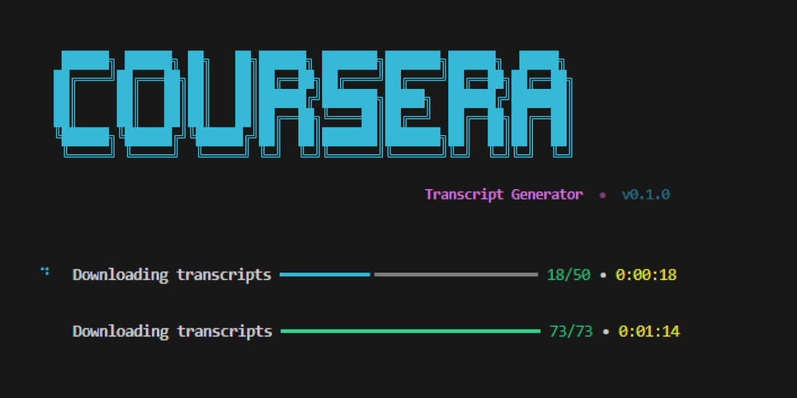

# 📚 Coursera Transcript Generator

A beautiful CLI tool to bulk-download transcripts and subtitles from any Coursera course you're enrolled in.




---

## ✨ Features

- **Interactive prompts** — guided step-by-step experience, no need to memorize flags
- **Bulk download** — grabs every lecture transcript in a course at once
- **Organized output** — files are neatly sorted into module folders
- **Progress tracking** — real-time progress bar with download status
- **Retry logic** — automatic retries with exponential backoff on failures
- **Multiple formats** — supports both `.txt` (plain text) and `.srt` (subtitle) formats
- **Multi-language** — download transcripts in any available language

---

## 📦 Installation

```bash
# Clone the repo
git clone https://github.com/your-username/coursera-transcript-generator.git
cd coursera-transcript-generator

# Install in editable mode
pip install -e .
```

---

## 🚀 Usage

### Interactive Mode (recommended)

Just run the command with no arguments — it will guide you through everything:

```bash
coursera-transcripts
```

You'll be prompted for:

1. **CAUTH cookie** — your Coursera authentication token
2. **Course slug** — the identifier from the course URL
3. **Options** — language, format, and output directory

### CLI Mode

Pass everything as flags for scripting / automation:

```bash
coursera-transcripts \
  --cookie "YOUR_CAUTH_VALUE" \
  --slug "machine-learning" \
  --language en \
  --format txt \
  --output ./transcripts
```

### All Options

| Flag         | Short | Default      | Description                    |
| ------------ | ----- | ------------ | ------------------------------ |
| `--cookie`   | `-c`  | _(prompted)_ | CAUTH cookie value             |
| `--slug`     | `-s`  | _(prompted)_ | Course slug from URL           |
| `--language` | `-l`  | `en`         | Subtitle language code         |
| `--format`   |       | `txt`        | Output format (`txt` or `srt`) |
| `--output`   | `-o`  | `./output`   | Parent output directory        |

---

## 🔑 Getting Your CAUTH Cookie

1. Open [coursera.org](https://www.coursera.org) and **log in**
2. Open **DevTools** (`F12` or `Ctrl+Shift+I`)
3. Go to **Application** → **Cookies** → `https://www.coursera.org`
4. Find the cookie named **`CAUTH`**
5. Copy its **Value**

> [!IMPORTANT]
> You must be **enrolled** in the course to download its transcripts.

---

## 📁 Output Structure

Transcripts are organized by module:

```
output/
└── machine-learning/
    ├── introduction-to-ml/
    │   ├── Welcome to Machine Learning.txt
    │   ├── What is Machine Learning.txt
    │   └── Supervised Learning.txt
    ├── linear-regression/
    │   ├── Model Representation.txt
    │   └── Cost Function.txt
    └── ...
```

---

## 🔧 Finding the Course Slug

The slug is the part of the URL after `/learn/`:

```
https://www.coursera.org/learn/machine-learning
                                └── this is the slug
```

---

## 📋 Requirements

- Python **3.10+**
- A Coursera account with enrollment in the target course

---

## 📄 License

MIT
